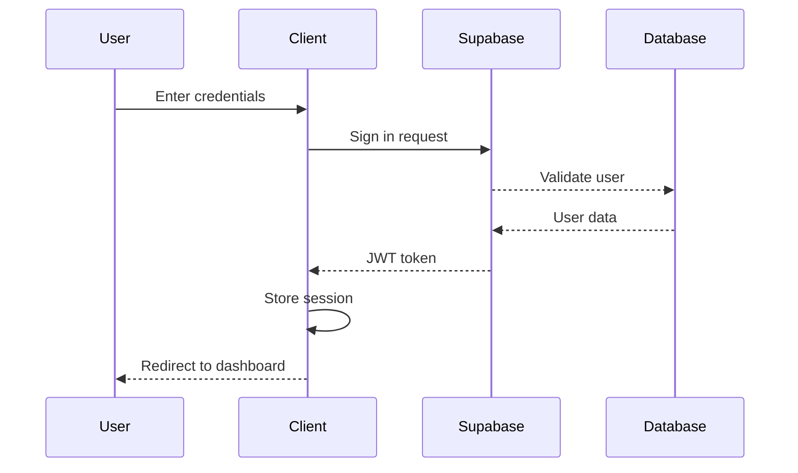

# Quizify - Interactive Learning Platform

A real-time collaborative learning platform built with Next.js, featuring interactive quizzes, collaborative whiteboarding, and live chat functionality.

## 🚀 Table of Contents
- [Features](#-features)
- [System Architecture](#-system-architecture)
- [Project Structure](#-project-structure)
- [Core Components](#-core-components)
- [Technical Stack](#-technical-stack)
- [Setup and Installation](#-setup-and-installation)
- [Socket Events](#-socket-events)
- [Authentication](#-authentication)
- [Game Mechanics](#-game-mechanics)
- [Deployment](#-deployment)
- [Contributing](#-contributing)
- [License](#-license)

## 🚀 Features

### Interactive Quiz System
- **Real-time Multiplayer**
  - Synchronized quiz sessions across all participants
  - Live player status updates
  - Dynamic score adjustments
  - Real-time answer validation

- **Scoring System**
  - Time-based point calculation (faster answers = more points)
  - Streak bonuses (up to 4x multiplier)
  - Power-up modifiers
  - Achievement points

- **Achievement System**
  - First correct answer badge
  - Streak achievements (3, 5, 10 correct answers)
  - Speed demon (quick answers)
  - Perfect score recognition

- **Power-ups**
  - Time freeze (pause timer)
  - Double points
  - 50/50 (remove two wrong answers)
  - Answer shield (prevent point loss)

### Collaborative Whiteboard
- **Drawing Tools**
  - Freehand pen with adjustable width
  - Shape tools (rectangle, circle, line)
  - Text insertion with font sizing
  - Smart eraser tool
  - Selection and move functionality

- **Real-time Features**
  - Synchronized drawing across all users
  - Cursor position tracking
  - Layer management
  - Undo/Redo support

### Live Chat
- **Message System**
  - Real-time message delivery
  - Message history persistence
  - User typing indicators
  - Read receipts

## 💡 System Architecture

### Frontend Architecture
```
┌─────────────────────────────────────────────────────┐
│                  Next.js Frontend                    │
├─────────────┬─────────────────────┬─────────────────┤
│  Pages      │    Components       │    Services      │
├─────────────┼─────────────────────┼─────────────────┤
│ - App Router│ - Quiz Components   │ - Socket Service │
│ - API Routes│ - Room Components   │ - Auth Service   │
│ - Layouts   │ - UI Components     │ - State Mgmt    │
└─────────────┴─────────────────────┴─────────────────┘
```

### Data Flow
```
┌──────────┐    ┌──────────┐    ┌───────────┐
│  Client  │◄──►│  Socket  │◄──►│  Server   │
└──────────┘    └──────────┘    └───────────┘
     ▲               ▲               ▲
     │               │               │
     ▼               ▼               ▼
┌──────────┐    ┌──────────┐    ┌───────────┐
│ Supabase │◄──►│  State   │◄──►│  Database │
└──────────┘    └──────────┘    └───────────┘
```

### State Management
```
┌─────────────────────────────────────────┐
│              Global State               │
├─────────────────┬───────────────────────┤
│ Authentication  │ - User session        │
│                 │ - Permissions         │
├─────────────────┼───────────────────────┤
│ Room State      │ - Active users       │
│                 │ - Room settings      │
├─────────────────┼───────────────────────┤
│ Quiz State      │ - Current question   │
│                 │ - Scores             │
│                 │ - Timer              │
├─────────────────┼───────────────────────┤
│ Whiteboard State│ - Drawing data       │
│                 │ - Tool selection     │
└─────────────────┴───────────────────────┘
```

## 🔧 Technical Stack

### Frontend Technologies
- **Framework**: Next.js 14 (App Router)
- **Language**: TypeScript 5.x
- **Styling**: Tailwind CSS 3.4
- **State Management**: React Context + Hooks
- **Real-time**: Socket.IO Client 4.8
- **UI Components**: 
  - Framer Motion (animations)
  - Lucide React (icons)
  - Sonner (toasts)
  - React-PDF (document viewing)

### Backend Services
- **Authentication**: Supabase Auth
- **Database**: Supabase PostgreSQL
- **Real-time**: Socket.IO Server
- **File Storage**: Supabase Storage

### Development Tools
- **Package Manager**: npm
- **Linting**: ESLint
- **Type Checking**: TypeScript
- **Code Formatting**: Prettier
- **Version Control**: Git
- **CI/CD**: Netlify

## 🏗 Project Structure

```
client/
├── src/
│   ├── app/                          # Next.js app router pages
│   │   ├── dashboard/               # Dashboard related pages
│   │   │   ├── page.tsx            # Dashboard main page
│   │   │   └── room/              # Room-specific components
│   │   │       ├── [roomId]/      # Dynamic room routes
│   │   │       │   └── page.tsx   # Individual room page
│   │   │       └── page.tsx       # Room list page
│   │   ├── login/                 # Authentication pages
│   │   │   └── page.tsx          # Login page
│   │   └── layout.tsx            # Root layout
│   ├── components/
│   │   ├── quiz/                  # Quiz-related components
│   │   │   ├── QuizRoom.tsx      # Main quiz interface
│   │   │   ├── QuizTimer.tsx     # Timer component
│   │   │   ├── ScoreBoard.tsx    # Leaderboard component
│   │   │   └── Achievements.tsx  # Achievement display
│   │   ├── room/                 # Room-related components
│   │   │   ├── Whiteboard.tsx    # Collaborative whiteboard
│   │   │   ├── Chat.tsx         # Live chat component
│   │   │   └── RoomHeader.tsx   # Room header with controls
│   │   └── ui/                  # Shared UI components
│   │       ├── Button.tsx       # Custom button component
│   │       ├── Input.tsx        # Form input component
│   │       └── Modal.tsx        # Modal dialog component
│   ├── contexts/                # React contexts
│   │   ├── SupabaseContext.tsx  # Supabase auth context
│   │   └── SocketContext.tsx    # Socket.IO context
│   ├── hooks/                   # Custom React hooks
│   │   ├── useSocket.ts        # Socket.io connection hook
│   │   ├── useAuth.ts          # Authentication hook
│   │   └── useRoom.ts          # Room management hook
│   ├── types/                  # TypeScript type definitions
│   │   ├── quiz.ts            # Quiz-related types
│   │   ├── room.ts           # Room-related types
│   │   └── user.ts          # User-related types
│   ├── utils/                # Utility functions
│   │   ├── api.ts           # API helper functions
│   │   ├── socket.ts        # Socket helper functions
│   │   └── validation.ts    # Form validation
│   └── styles/              # Global styles
└── public/                  # Static assets
    ├── images/             # Image assets
    └── sounds/            # Sound effects
```

## 🔌 Socket Events

### Quiz Events
```typescript
interface QuizEvents {
  // Emitted when starting a new quiz
  'start_quiz': (data: { roomId: string }) => void;
  
  // Emitted when submitting an answer
  'quiz_answer': (data: {
    roomId: string;
    questionId: number;
    answer: number;
    timeLeft: number;
    points: number;
    multiplier: number;
  }) => void;
  
  // Received when scores are updated
  'score_update': (players: Player[]) => void;
  
  // Received when achievement is unlocked
  'achievement_unlocked': (achievement: Achievement) => void;
  
  // Received when power-up is activated
  'powerup_received': (powerUp: PowerUp) => void;
}
```

### Whiteboard Events
```typescript
interface WhiteboardEvents {
  // Emitted when drawing a line
  'draw_line': (data: {
    roomId: string;
    line: {
      points: Point[];
      color: string;
      width: number;
      id: string;
    }
  }) => void;
  
  // Emitted when clearing canvas
  'clear_canvas': (data: { roomId: string }) => void;
  
  // Emitted when undoing action
  'undo_action': (data: { roomId: string; actionId: string }) => void;
}
```

## 🔐 Authentication Flow



## 🎮 Game Mechanics

### Quiz System
- Points calculation based on answer speed and accuracy
- Streak multipliers (up to 4x)
- Achievement tracking
- Power-up system
- Real-time leaderboard updates

### Whiteboard Tools
- Freehand drawing
- Shape tools (rectangle, circle)
- Text tool
- Eraser
- Color picker
- Clear canvas

## 🚀 Deployment

The application can be deployed on Netlify:

1. Connect your repository to Netlify
2. Configure build settings:
   - Build command: `npm run build`
   - Publish directory: `.next`
3. Set environment variables in Netlify dashboard
4. Enable automatic deployments

## 🤝 Contributing

1. Fork the repository
2. Create a feature branch
3. Commit your changes
4. Push to the branch
5. Open a Pull Request

## 📝 License

This project is licensed under the MIT License - see the LICENSE file for details.
