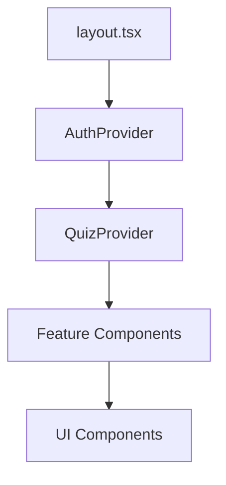
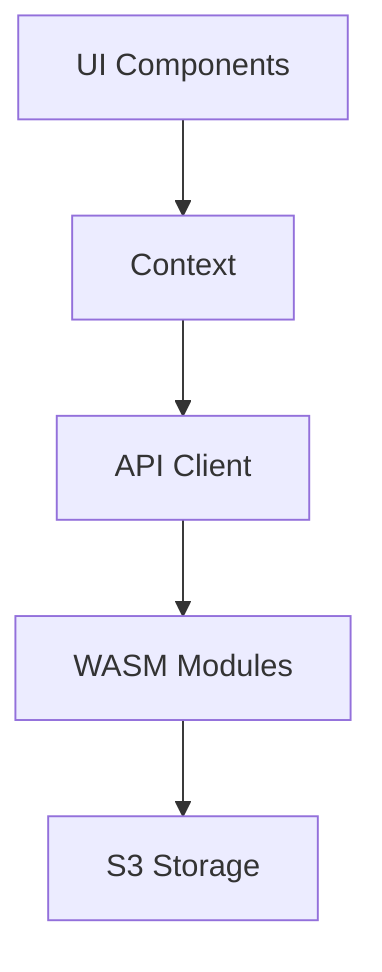

# File Purposes Documentation

## Core Application Files

### `app/layout.tsx`
**Purpose**: Root layout configuration
- Manages global fonts (Geist)
- Handles dark/light mode
- Sets up metadata
- Initializes global providers

### `app/page.tsx`
**Purpose**: Landing page
- Entry point for the application
- Handles initial routing
- Manages authentication state
- Renders main quiz interface

## Component Directory Structure

### UI Components (`components/ui/`)
```
ui/
├── Button/
│   ├── Button.tsx           # Reusable button component
│   └── ButtonTypes.ts       # Button type definitions
├── Card/
│   ├── Card.tsx            # Card container component
│   └── CardTypes.ts        # Card type definitions
└── Input/
    ├── Input.tsx           # Form input component
    └── InputTypes.ts       # Input type definitions
```

### Feature Components (`components/features/`)
```
features/
├── Quiz/
│   ├── QuizCreator.tsx     # Quiz creation interface
│   ├── QuizTaker.tsx       # Quiz taking interface
│   └── QuizResults.tsx     # Results display
└── Auth/
    ├── LoginForm.tsx       # Login interface
    └── RegisterForm.tsx    # Registration interface
```

## Library Files (`lib/`)

### Authentication (`lib/auth/`)
```typescript
// AuthContext.tsx
// Purpose: Global authentication state management
export const AuthContext = createContext<AuthContextType>(null);

// AuthProvider.tsx
// Purpose: Provides authentication methods and state
export const AuthProvider: FC<Props> = ({ children }) => {
  // Authentication logic
};
```

### Quiz Engine (`lib/quiz-engine/`)
```typescript
// QuizContext.tsx
// Purpose: Manages quiz state and logic
export const QuizContext = createContext<QuizContextType>(null);

// quizTypes.ts
// Purpose: Defines quiz-related types
export interface Quiz {
  id: string;
  questions: Question[];
  // ...
}
```

### Data Management (`lib/data/`)
```typescript
// api.ts
// Purpose: API client configuration and methods
export const apiClient = {
  get: async () => {},
  post: async () => {},
  // ...
};

// storage.ts
// Purpose: Local storage management
export const storage = {
  set: (key: string, value: any) => {},
  get: (key: string) => {},
  // ...
};
```

## WebAssembly Integration (`wasm/`)

### Quiz Engine WASM (`wasm/quiz-engine/`)
```rust
// validation.rs
// Purpose: High-performance quiz validation
pub fn validate_submission(answers: &[Answer]) -> bool {
    // Validation logic
}

// scoring.rs
// Purpose: Fast score calculation
pub fn calculate_score(responses: &[Response]) -> Score {
    // Scoring logic
}
```

### Data Processing WASM (`wasm/data-processing/`)
```rust
// compression.rs
// Purpose: Data compression for storage
pub fn compress_data(data: &[u8]) -> Vec<u8> {
    // Compression logic
}

// encryption.rs
// Purpose: Data encryption for security
pub fn encrypt_data(data: &[u8], key: &[u8]) -> Vec<u8> {
    // Encryption logic
}
```

## Configuration Files

### `next.config.js`
**Purpose**: Next.js configuration
- WebAssembly loader setup
- Environment variables
- Build optimization

### `tailwind.config.js`
**Purpose**: Tailwind CSS configuration
- Custom theme
- Plugin configuration
- Responsive breakpoints

### `tsconfig.json`
**Purpose**: TypeScript configuration
- Compiler options
- Path aliases
- Type checking rules

## Testing Files

### `__tests__/`
```
__tests__/
├── components/           # Component tests
├── integration/         # Integration tests
└── e2e/                # End-to-end tests
```

## Future Implementation Files

### S3 Integration (`lib/storage/`)
```typescript
// s3Client.ts
// Purpose: S3 client configuration
export const s3Client = new S3Client({
  region: process.env.AWS_REGION,
  // ...
});

// uploadManager.ts
// Purpose: Manages file uploads to S3
export const uploadManager = {
  uploadFile: async (file: File) => {},
  getSignedUrl: async (key: string) => {},
  // ...
};
```

## Critical File Dependencies

### Component Dependencies


### Data Flow Dependencies
