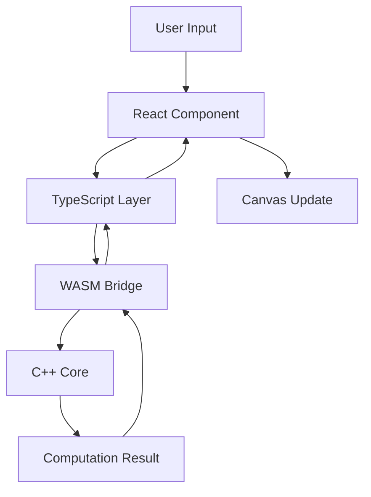

# Quizify Frontend System Design

## System Architecture Overview

```
┌─────────────────────────────────────────────────────────┐
│                    Client Application                    │
├─────────────────┬───────────────────┬──────────────────┤
│   Pages Layer   │  Component Layer  │   Service Layer   │
└────────┬────────┴────────┬─────────┴─────────┬────────┘
         │                 │                    │
         ▼                 ▼                    ▼
    Page Routes      Shared Components     API Services
    Layouts          UI Components        State Management
    Metadata         Custom Hooks         Data Fetching
```

## 1. Core Layers

### 1.1 Pages Layer (`app/`)
- Next.js 13+ App Router implementation
- Server and Client Components separation
- Layout system with nested routing
- Metadata management
- Error boundaries

### 1.2 Component Layer (`components/`)
```
components/
├── ui/                  # Basic UI components
│   ├── Button/
│   ├── Card/
│   └── Input/
├── features/           # Feature-specific components
│   ├── Quiz/
│   └── Auth/
└── layout/            # Layout components
    ├── Header/
    └── Footer/
```

### 1.3 Service Layer (`lib/`)
```
lib/
├── api/              # API client and endpoints
├── hooks/            # Custom React hooks
├── utils/            # Utility functions
└── context/          # React Context providers
```

## 2. Data Flow Architecture

```
┌──────────────┐    ┌───────────────┐    ┌──────────────┐
│   UI Event   │ -> │ State Manager │ -> │  API Client  │
└──────────────┘    └───────────────┘    └──────────────┘
       ▲                    │                    │
       │                    ▼                    ▼
┌──────────────┐    ┌───────────────┐    ┌──────────────┐
│  Component   │ <- │  Data Store   │ <- │ Server API   │
└──────────────┘    └───────────────┘    └──────────────┘
```

## 3. Component Architecture

### 3.1 Component Hierarchy
```
Layout (app/layout.tsx)
└── Page (app/page.tsx)
    ├── Feature Components
    │   └── UI Components
    └── Shared Components
        └── UI Components
```

### 3.2 State Management
- React Context for global state
- Component-level state with useState
- Server state with React Query/SWR
- Form state with React Hook Form

## 4. Performance Optimization

### 4.1 Code Splitting
- Dynamic imports
- Route-based splitting
- Component lazy loading

### 4.2 Caching Strategy
```
┌─────────────┐    ┌──────────────┐    ┌────────────┐
│ Memory Cache│ -> │ Local Storage│ -> │ Server API │
└─────────────┘    └──────────────┘    └────────────┘
```

### 4.3 Asset Optimization
- Image optimization with next/image
- Font optimization with next/font
- Static asset caching

## 5. Security Measures

### 5.1 Client-side Security
- Input validation
- XSS prevention
- CSRF protection
- Secure storage handling

### 5.2 API Security
- Authentication headers
- Rate limiting
- Error handling
- Data sanitization

## 6. Testing Strategy

### 6.1 Testing Layers
```
┌─────────────────┐
│    E2E Tests    │
├─────────────────┤
│Integration Tests│
├─────────────────┤
│   Unit Tests    │
└─────────────────┘
```

## 7. Deployment Architecture

### 7.1 Build Process
```
Source Code
    │
    ▼
TypeScript Compilation
    │
    ▼
Bundle Optimization
    │
    ▼
Asset Optimization
    │
    ▼
Production Build
```

### 7.2 Deployment Flow
```
┌──────────┐    ┌──────────┐    ┌──────────┐
│  GitHub  │ -> │  CI/CD   │ -> │  Vercel  │
└──────────┘    └──────────┘    └──────────┘
```

## 8. Monitoring and Analytics

### 8.1 Performance Monitoring
- Core Web Vitals
- Custom performance metrics
- Error tracking
- User behavior analytics

### 8.2 Error Handling
```
┌──────────┐    ┌──────────┐    ┌──────────┐
│ Try/Catch │ -> │ ErrorLog │ -> │ Reporter │
└───────────┘    └──────────┘    └──────────┘
```

## 9. Future Scalability

### 9.1 Planned Improvements
1. Micro-frontend architecture
2. Web Workers implementation
3. Service Worker caching
4. Server-side streaming
5. WebSocket integration

### 9.2 Performance Goals
- First Contentful Paint < 1.2s
- Time to Interactive < 2.5s
- Lighthouse score > 90
- Bundle size < 100KB (initial) 

## 10. Whiteboard System Architecture

### 10.1 Core Components
```
┌─────────────────────────────────────────────────────────┐
│                  Whiteboard System                       │
├─────────────────┬───────────────────┬──────────────────┤
│   C++ Core      │   WASM Bridge     │    React Layer   │
└────────┬────────┴────────┬─────────┴─────────┬────────┘
         │                 │                    │
         ▼                 ▼                    ▼
    Computations     Data Transfer      UI Components
    Geometry         Memory Mgmt        Event Handling
    Optimization     Type Convert       State Management
```

### 10.2 Data Flow


### 10.3 Performance Optimizations
- **Vector Operations**: Handled in C++
- **Matrix Transformations**: SIMD operations
- **Memory Management**: Manual control
- **Rendering Pipeline**: Direct canvas manipulation

### 10.4 Critical Paths
```
User Input → Event Capture → WASM Delegation → C++ Processing → Canvas Update
```

### 10.5 Memory Management
```cpp
// Memory Layout
struct MemoryPool {
    void* strokeData;      // Dynamic stroke data
    void* geometryBuffer;  // Geometric calculations
    void* renderCache;     // Render optimization
};
```

### 10.6 Integration Points
```typescript
// TypeScript to C++ Bridge
interface WasmBridge {
    // Memory Management
    allocateMemory(size: number): Pointer;
    releaseMemory(ptr: Pointer): void;

    // Drawing Operations
    handleStroke(data: StrokeData): void;
    processGeometry(shape: ShapeData): void;

    // Optimization
    optimizeCanvas(state: CanvasState): void;
}
```

### 10.7 Performance Goals
- Stroke Latency: < 16ms (60 FPS)
- Memory Usage: < 100MB
- CPU Usage: < 30%
- Canvas Redraw: < 8ms

## 11. S3 Integration

### 11.1 Media Storage
```typescript
interface S3Storage {
    // Whiteboard State
    saveCanvasState(state: CanvasState): Promise<string>;
    loadCanvasState(id: string): Promise<CanvasState>;

    // Assets
    uploadAsset(file: File): Promise<string>;
    getAssetUrl(key: string): Promise<string>;
}
```

### 11.2 Backup System
```typescript
interface BackupSystem {
    // Automatic Backups
    scheduleBackup(frequency: BackupFrequency): void;
    restoreFromBackup(timestamp: number): Promise<void>;

    // Manual Saves
    createSnapshot(): Promise<string>;
    restoreSnapshot(id: string): Promise<void>;
}
```

### 11.3 CDN Integration
```typescript
interface CDNConfig {
    // Asset Distribution
    distributeAsset(asset: Asset): Promise<string>;
    invalidateCache(pattern: string): Promise<void>;

    // Performance
    optimizeDelivery(region: Region): void;
}
```

## 12. Performance Monitoring

### 12.1 Metrics
```typescript
interface PerformanceMetrics {
    // WASM Performance
    wasmExecutionTime: number;
    memoryUsage: number;
    cpuUtilization: number;

    // Canvas Performance
    frameRate: number;
    renderTime: number;
    strokeLatency: number;
}
```

### 12.2 Optimization Strategies
1. **WebAssembly Optimizations**
   - SIMD operations
   - Memory pooling
   - Worker threads

2. **Canvas Optimizations**
   - Layer management
   - Batch rendering
   - Resolution scaling

3. **Network Optimizations**
   - State compression
   - Delta updates
   - Predictive loading 